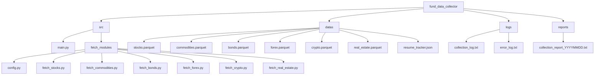

# Fund Data Collector

금융 데이터 수집기 - 주식, 원자재, 채권, 외환, 암호화폐, 부동산 데이터를 수집하고 저장하는 도구입니다.

## 프로젝트 구조



## 설치 방법

1. 저장소 클론
```bash
git clone https://github.com/yourusername/fund_data_collector.git
cd fund_data_collector
```

2. 가상환경 생성 및 활성화
```bash
python -m venv venv
source venv/bin/activate  # Linux/Mac
venv\Scripts\activate     # Windows
```

3. 의존성 설치
```bash
pip install -r requirements.txt
```

4. 환경 변수 설정
`.env` 파일을 생성하고 다음 변수들을 설정합니다:
```
FRED_API_KEY=your_fred_api_key
BINANCE_API_KEY=your_binance_api_key
BINANCE_API_SECRET=your_binance_api_secret
```

## 사용 방법

```bash
python src/main.py
```

## 데이터 구조

### 1. 주식 데이터 (stocks.parquet)
- **수집 대상**: 주요 주가지수 (S&P 500, 다우존스, 나스닥, FTSE 100, 닛케이 225)
- **컬럼 구조**:
  - `date`: 날짜 (datetime)
  - `symbol`: 지수 심볼 (string)
  - `open`: 시가 (float)
  - `high`: 고가 (float)
  - `low`: 저가 (float)
  - `close`: 종가 (float)
  - `volume`: 거래량 (float)

### 2. 원자재 데이터 (commodities.parquet)
- **수집 대상**: 주요 원자재 ETF (금, 원유, 은, 원자재 종합)
- **컬럼 구조**:
  - `date`: 날짜 (datetime)
  - `symbol`: ETF 심볼 (string)
  - `open`: 시가 (float)
  - `high`: 고가 (float)
  - `low`: 저가 (float)
  - `close`: 종가 (float)
  - `volume`: 거래량 (float)

### 3. 채권 데이터 (bonds.parquet)
- **수집 대상**: 주요 채권 금리 (10년/2년/30년 국채, 10년 회사채)
- **컬럼 구조**:
  - `date`: 날짜 (datetime)
  - `series`: 시리즈 코드 (string)
  - `value`: 금리 값 (float)

### 4. 외환 데이터 (forex.parquet)
- **수집 대상**: 주요 통화쌍 (EUR/USD, USD/JPY, GBP/USD, USD/CHF, AUD/USD)
- **컬럼 구조**:
  - `date`: 날짜 (datetime)
  - `symbol`: 통화쌍 심볼 (string)
  - `open`: 시가 (float)
  - `high`: 고가 (float)
  - `low`: 저가 (float)
  - `close`: 종가 (float)
  - `volume`: 거래량 (float)

### 5. 암호화폐 데이터 (crypto.parquet)
- **수집 대상**: 주요 암호화폐 (BTC, ETH, BNB, XRP, ADA)
- **컬럼 구조**:
  - `date`: 날짜 (datetime)
  - `symbol`: 코인 심볼 (string)
  - `open`: 시가 (float)
  - `high`: 고가 (float)
  - `low`: 저가 (float)
  - `close`: 종가 (float)
  - `volume`: 거래량 (float)

### 6. 부동산 데이터 (real_estate.parquet)
- **수집 대상**: 주요 부동산 ETF (VNQ, IYR, SCHH, RWR, REET)
- **컬럼 구조**:
  - `date`: 날짜 (datetime)
  - `symbol`: ETF 심볼 (string)
  - `open`: 시가 (float)
  - `high`: 고가 (float)
  - `low`: 저가 (float)
  - `close`: 종가 (float)
  - `volume`: 거래량 (float)

### 7. 진행 상태 추적 (resume_tracker.json)
- 각 데이터 수집기의 마지막 수집 날짜와 수집 대상 심볼 정보를 저장
- JSON 형식으로 저장되며, 각 데이터 타입별로 다음 정보를 포함:
  - `last_fetch_date`: 마지막 수집 날짜
  - `symbols` 또는 `series`: 수집 대상 심볼/시리즈 목록

## 로그 및 보고서

### 로그 파일
- `logs/collection_log.txt`: 데이터 수집 진행 상황 로그
- `logs/error_log.txt`: 오류 발생 시 상세 로그

### 보고서 파일
- `reports/collection_report_YYYYMMDD.txt`: 일별 데이터 수집 결과 보고서

## 라이선스

이 프로젝트는 MIT 라이선스를 따릅니다. 